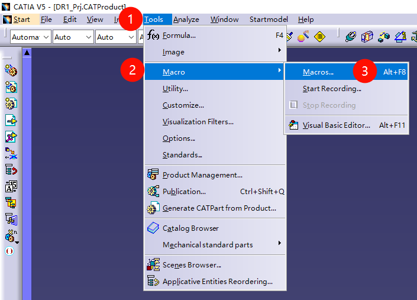
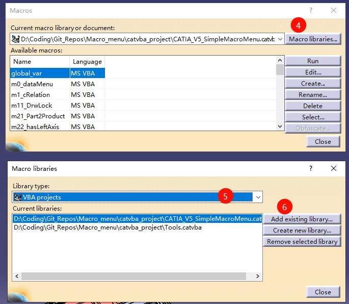
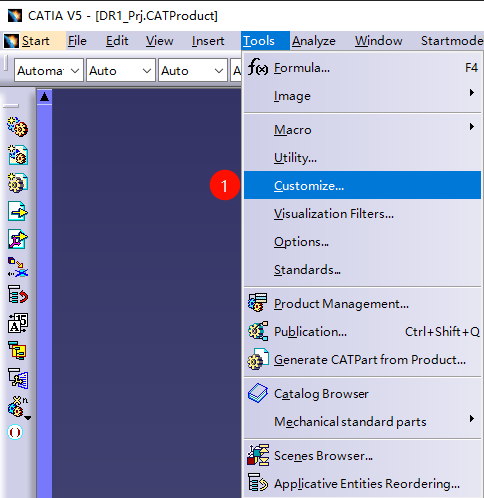
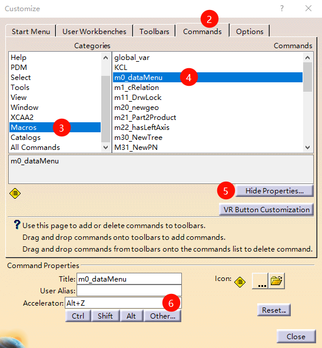
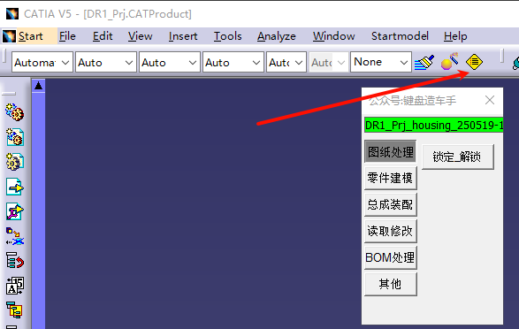

# ***CATIA V5宏菜单***
## 这是什么？
在catia程序中创建宏时，从菜单的调用宏很麻烦。此外，如果要注册到工具栏的宏数量很多，操作也很繁琐。本程序的目的是简化此类工作


## 如何安装：

+ 首先下载文件 CATIA_V5_SimpleMacroMenu.catvba。
+ 将CATIA_V5_SimpleMacroMenu.catvba文件复制到您喜欢的位置。路径最好不要包含中文.
  
***[step 1~3]***

+ 启动CATIA V5，然后点击 "工具" - "宏" - "宏..."。 

  start  CATIA V5，then click "Tools" - "Macros" - "Macros..."。

  

***[step 4~6]***

+ 在 "宏库..." - "VBA项目" - "添加现有库..." 中选择之前的 "xxx.catvba" 文件。

   click  "Macro Libraries..." and then select  "VBA Projects" at library type, then click "Add Existing Library..." and select the ".catvba" file you copied earlier.

  

  即可安装完成

## 注册到catia工具栏
+ 点击 "工具" - "自定义..."

  click "Tools" - "Customize..."

  

+ 在弹出的窗口中点击"命令"-"宏"-"m0-dataMenu"，然后自定义快捷键和图标，  并可以将"m0-dataMenu"命令拖动到菜单栏目

  click "Commands" - "Macros" - "m0-dataMenu" and then customize the shortcut and icon, and you can drag "m0-dataMenu" command to the menu bar

  


## 效果：
+ 如图点击你拖动到菜单栏的图标，或者按下你设置的快捷键可以启动该菜单程序。

  click the icon or press the shortcut to start the menu program.
  
  


***

## 编写您自己的宏：

此菜单程序仅支持宏的调用。因此，您需要有自己创建的宏。我已经创建了一些常用的宏，请在release页面下载使用

要在菜单中添加按钮，需要在VBA模块的声明部分描述信息「标签」。

在模块的开头和第一个函数之间添加注释。在以下示例中，是在「Option Explicit」之前的位置。


「标签」：
```vb
'vba sample_Part2Product_ver0.0.3  using-'KCL0.0.12'  by XX
'将零件转换为产品
'仅处理以实体、形状集、时间序列形状集显示的内容
'(草图不在处理范围内)

'{GP:1}
'{Caption:Pt→Pro}
'{ControlTipText:将零件转换为产品}

Option Explicit

Sub CATMain()
XXX 
end sub
```


***
[・要添加的宏（模块）标签的详细信息](https://kantoku.hatenablog.com/entry/2017/10/17/152746)

[・菜单设置相关](https://kantoku.hatenablog.com/entry/2017/10/19/125107)

***

