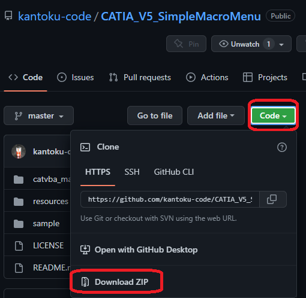
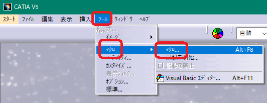
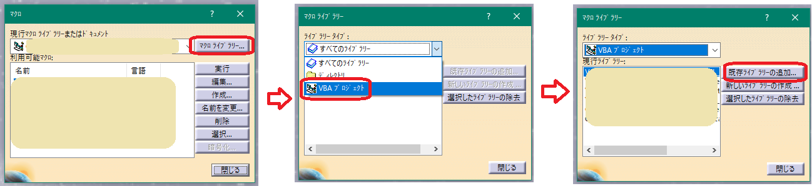
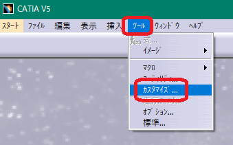
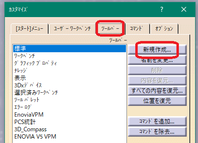
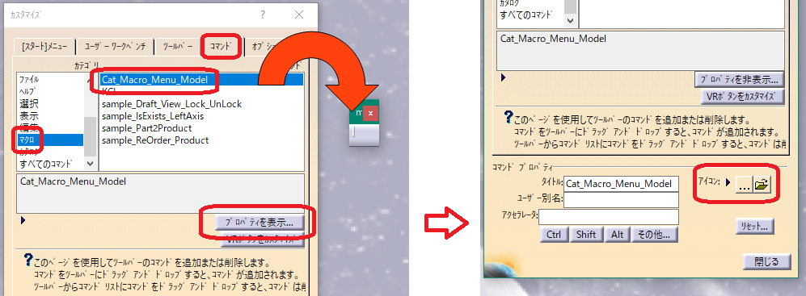
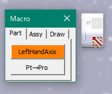

# ***CATIA V5宏菜单***


# ・这是什么？
当创建宏时，从菜单的宏部分调用它们很麻烦。
此外，如果要注册到工具栏的宏数量很多，这也非常麻烦
本宏的创建目的是减轻此类工作。
***
# ・安装：

+ 首先下载文件CATIA_V5_SimpleMacroMenu.catvba。



+ 进一步解压 "catvba_project" 文件夹中的 "CATIA_V5_SimpleMacroMenu.zip" 文件，并将 "CATIA_V5_SimpleMacroMenu.catvba" 文件复制到任意位置。此时，您可以将其重命名为任意文件名。

+ 启动CATIA V5，然后点击 "工具" - "宏" - "宏..."。



+ 在 "宏库..." - "VBA项目" - "添加现有库..." 中选择之前的 ".catvba" 文件。



+ 点击对话框中的 "关闭" 完成VBA项目的注册。

+ 为了调用菜单，将其注册到工具栏。点击 "工具" - "自定义..."。
※建议在CATIA V5上关闭所有文件的状态下进行工具栏注册，这样它将成为在所有工作台上显示的工具栏。



+ 点击 "工具栏" 选项卡 - "新建..."，输入您喜欢的名称。



+ 将 "命令" 选项卡设置为 "宏"。将 "Cat_Macro_Menu_Model" 拖放到之前创建的工具栏上。工具栏上会显示一个三角形图标，但由于它不太美观，建议点击 "显示属性..."，然后点击 "图标"，将其更改为任意图标。



+ 关闭 "自定义" 对话框，点击新创建的工具栏按钮，如果显示一个小对话框，则表示安装成功。



***

# 使用方法：
此宏仅支持宏的调用。因此，您需要有自己创建的宏。

要在菜单中添加按钮，需要在VBA模块的声明部分描述信息「标签」。

以下链接可能会对您有所帮助。

[・操作视频](https://kantoku.hatenablog.com/entry/2017/10/16/183806)

[・要添加的宏（模块）标签的详细信息](https://kantoku.hatenablog.com/entry/2017/10/17/152746)

[・菜单设置相关](https://kantoku.hatenablog.com/entry/2017/10/19/125107)

***

# 关于标签：

## 标签的位置

在模块的开头和第一个函数之间添加注释。在以下示例中，是在「Option Explicit」之前的位置。

```vb
'vba sample_Part2Product_ver0.0.3  using-'KCL0.0.12'  by Kantoku
'将零件转换为产品
'仅处理以实体、形状集、时间序列形状集显示的内容
'(草图不在处理范围内)

'{GP:1}
'{Caption:Pt→Pro}
'{ControlTipText:将零件转换为产品}

Option Explicit

Sub CATMain()
  ...
