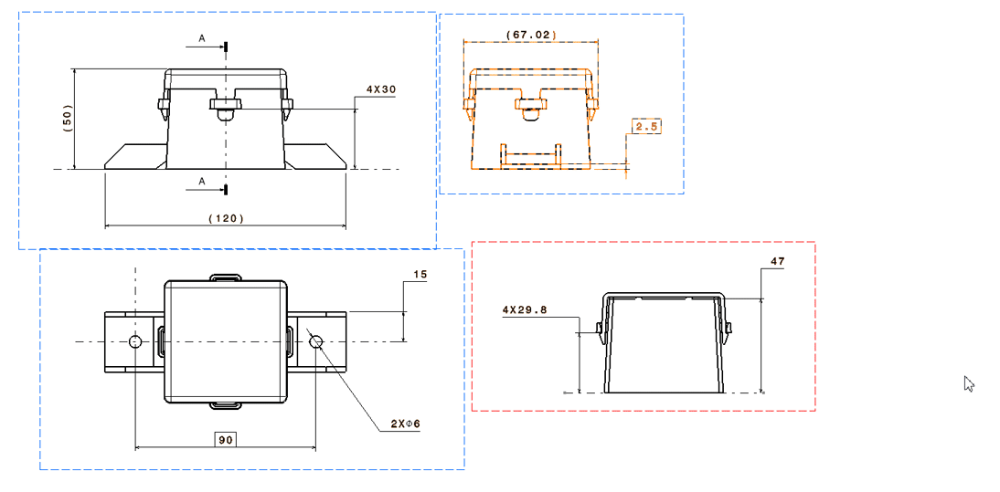
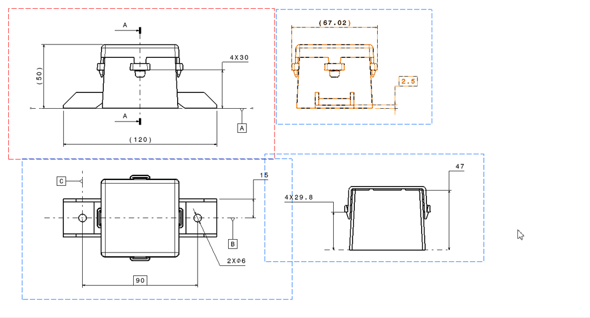
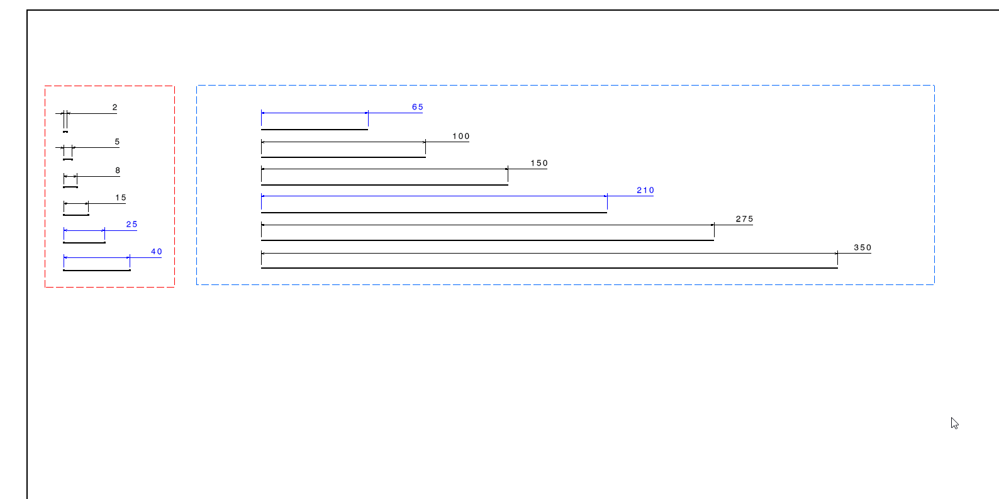
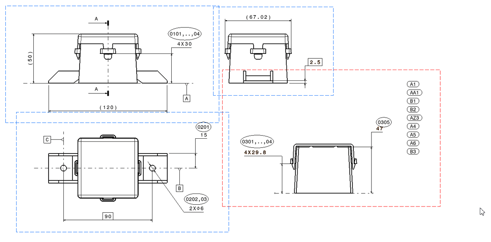
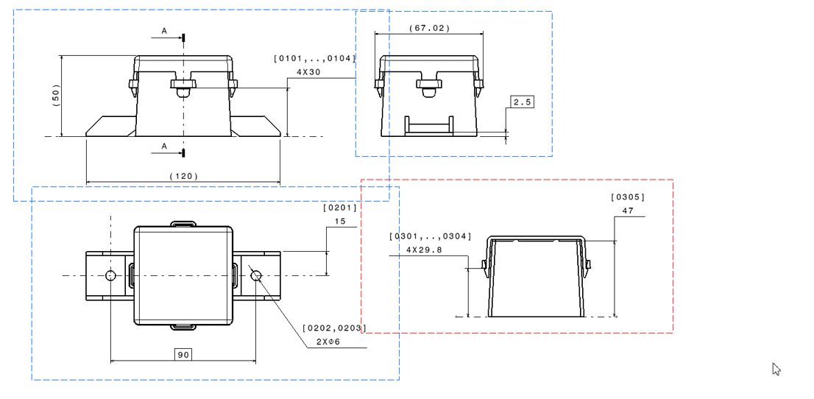
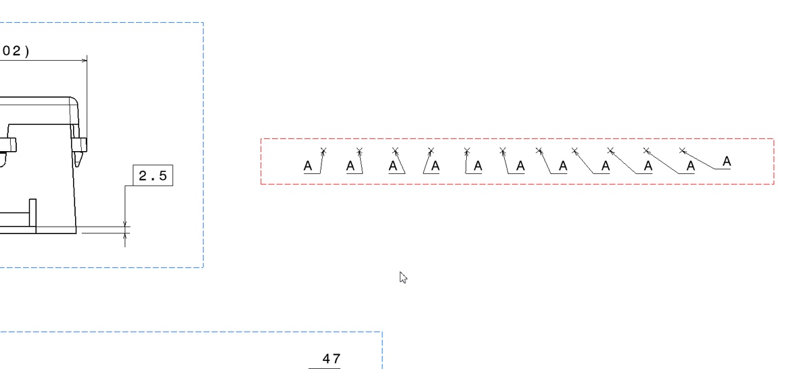
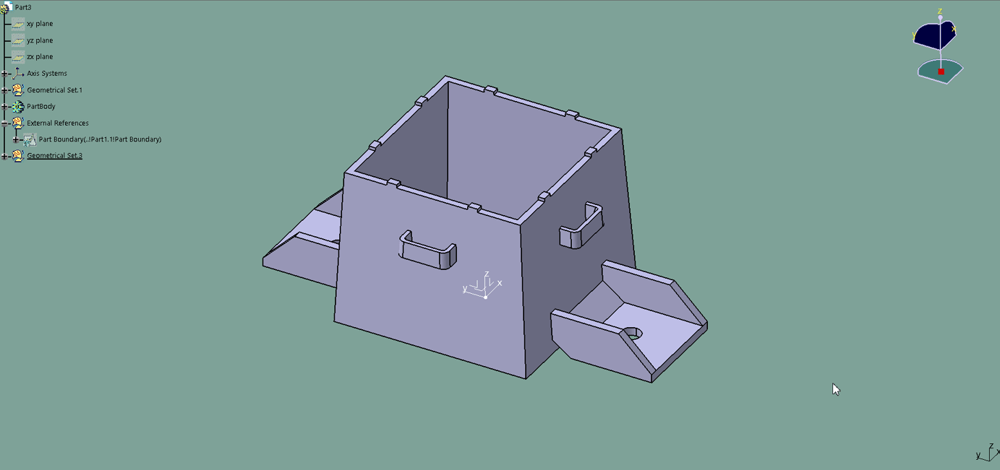
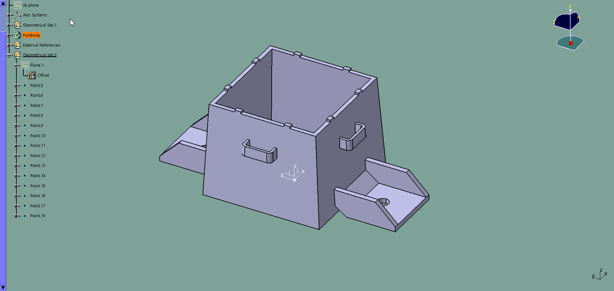
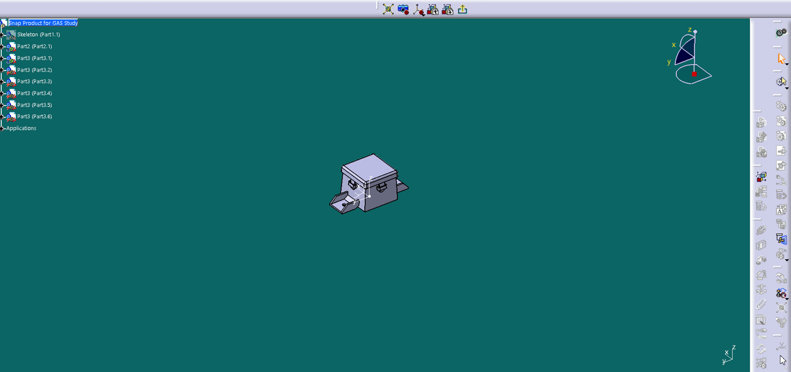

# Vectia Tools for CATIA V5

Vectia is an engineering productivity platform for CATIA V5. This toolkit of powerful macros streamlines critical workflows from initial design to final documentation. It's built to accelerate development, reduce manual error, and empower the modern engineer.

**This project is a personal initiative and is not affiliated with, sponsored, or endorsed by Dassault Systèmes.**

---

## Project Philosophy & AI Collaboration

The core philosophy of Vectia is to solve real-world engineering challenges through intelligent automation. As a Mechanical Design Engineer, I provided the process logic, user experience requirements, and iterative testing based on years of hands-on experience.

**The code structure, syntax, and implementation for these macros were generated in collaboration with an advanced AI assistant.** This project serves as a powerful example of human-AI partnership, combining expert domain knowledge with cutting-edge code generation to create robust, production-ready tools.

---

## Disclaimer

**Please read carefully before use:**

*   **No Warranty:** These macros are provided "as-is", without warranty of any kind, express or implied. The entire risk as to the quality and performance of the scripts is with you. In no event will the author be liable for any damages, including lost profits, lost savings, or other incidental or consequential damages arising out of the use or inability to use these scripts.
*   **Test in a Safe Environment:** Always test these macros on non-critical, backup files before using them in a production environment.
*   **Company Policy:** The use of these macros must comply with your organization's IT and IP policies. The author assumes no responsibility for misuse.

---

## Macro Suite

The suite is organized by the primary CATIA V5 workbench where the tool is used.

### Drafting & 2D Annotation

#### 1. Master Text Numbering (`Vectia_MasterTextNumbering_v1.1.catvbs`)
The flagship macro for creating visually perfect, associative VVNN numbering. It uses a pre-selected text object as a template, ensuring perfect compliance with any custom graphical standard.
**New in v1.1:** Features dynamic horizontal offsets to perfectly center the numbering text over single, double, and multi-instance dimensions.

**How to Use:**
1.  Select your "Master Text" object first, then CTRL+select all target Dimensions/GDTs.
2.  Run the macro and follow the prompts.

#### 2. Smart Bault/Upper Text Numbering (`Vectia_BaultTextNumbering.catvbs`)
An intelligent tool for editing existing drawings. It scans views for the highest existing VVNN number and continues the sequence by modifying the `BaultText` of dimensions or the `Upper Text` of GDTs.

*   **How to Use:** Select all target Dimensions and GDTs you wish to number. Run the macro and follow the prompts.

#### 3. General Tolerancer (ISO 20457) (`Vectia_ApplyTolerances_ISO20457_v1.0.catvbs`)
An advanced tool that applies general tolerances to all dimensions in a drawing based on the ISO 20457 standard for plastic parts. It recommends a tolerance group based on material and intelligently distinguishes between tool-specific and non-tool-specific dimensions.
Please note that this works only for linear dimensions. No support for GD&Ts

*   **How to Use:** Run the macro in an active drawing and follow the prompts for material family and tolerance group confirmation.

#### 4. Drawing Reset Utility (`Vectia_DrawingResetUtility.catvbs`)
A powerful cleanup tool for removing specific annotations from a drawing sheet or a single view.

*   **How to Use:** Run the macro and choose from the menu whether to delete VVNN numbering text, revision balloons, or both, and from which scope (active view or all views).

#### 5. Numbering Reset Utility (`Vectia_NumberingResetUtility_v1.0.catvbs`)
A focused cleanup tool that removes all `[VVNN]` style numbering from the Bault Text of dimensions and the Upper Text of GDTs on the active sheet.

*   **How to Use:** Run the macro and confirm the action.

#### 6. Sequential Text Editor (`Vectia_TextSequenceEditor.catvbs`)
A simple utility for quickly renumbering a series of selected text objects.

*   **How to Use:** Select a series of `DrawingText` objects in the desired order. Run the macro and provide a prefix (optional) and a starting number.

---

### Part Design & 3D Geometry

#### 1. Bounding Box Wireframe Creator (`Vectia_BoundingBoxCreator.catvbs`)
Creates a complete, accurate wireframe bounding box around a selected Body or HybridBody, aligned to a chosen axis system.

*   **How to Use:** Run the macro and follow the prompts to select the target body and the reference axis system.

#### 2. Smart Feature Renamer (`Vectia_SmartFeatureRenamer.catvbs`)
A versatile tool for sequentially renaming any selected features in the specification tree. It intelligently handles leading zeros based on the user's starting number.

*   **How to Use:** Select the features you want to rename in the desired order. Run the macro and provide a prefix (optional) and a starting number (e.g., `1`, `01`, `001`).
---

### Assembly Design

#### 1. Simple 3D Explode Scene (`Vectia_SceneExploder.catvbs`)
Creates a simple, linear exploded view by moving selected parts along a global axis. This macro directly modifies part positions and is best used within the "Enhanced Scene" workbench.

*   **How to Use:** Select all parts to be exploded in the specification tree. Run the macro and provide the explosion axis (X, Y, or Z) and the spacing distance.

---

## License
This project is licensed under the **MIT License**, which is a permissive open-source license. In simple terms, you are free to use, copy, modify, and distribute this software, but it is provided without warranty. See the `LICENSE` file for full details.
